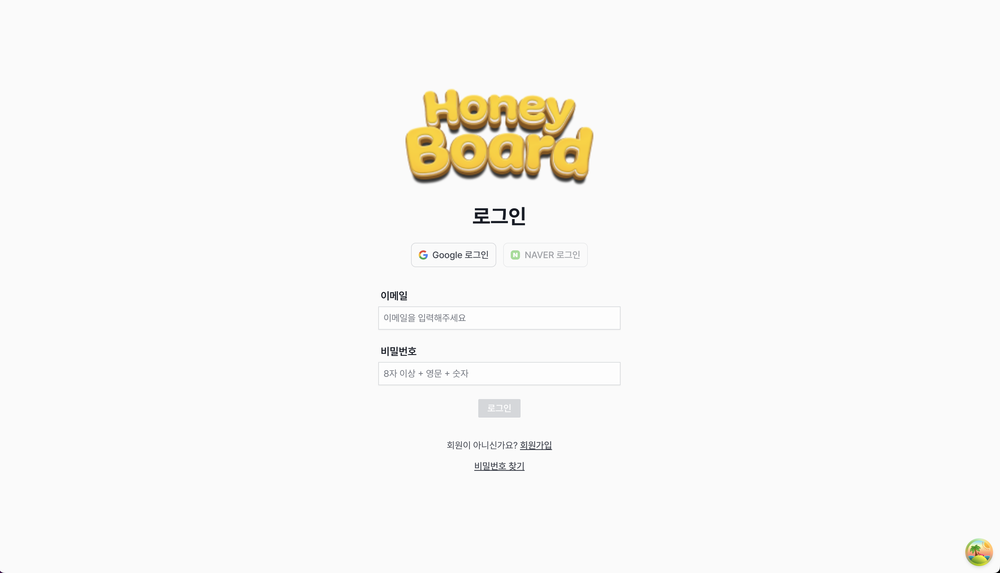
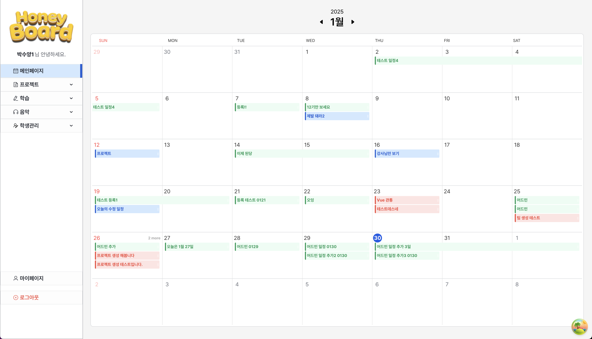
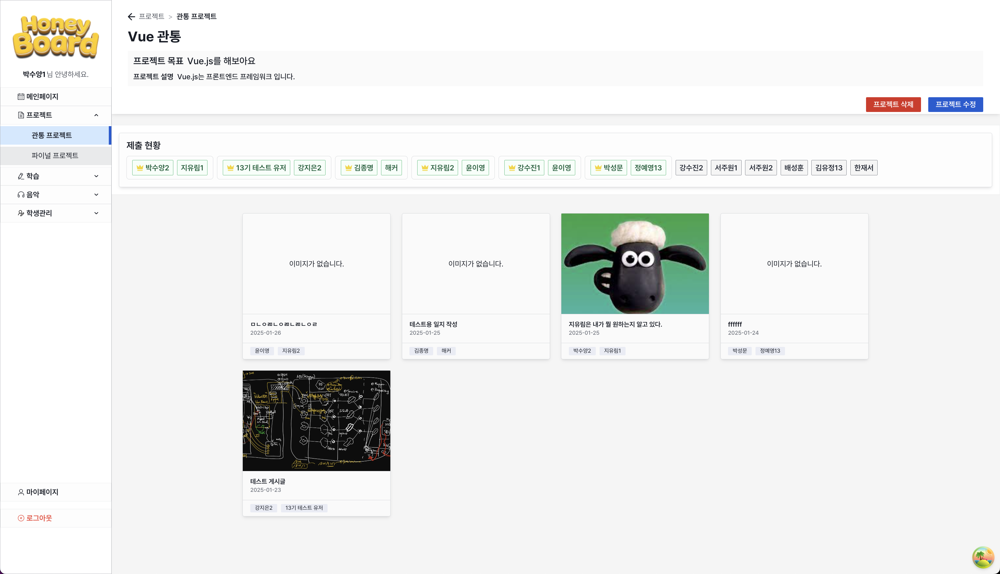
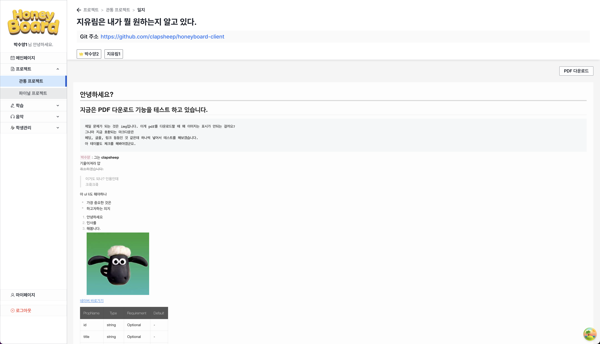
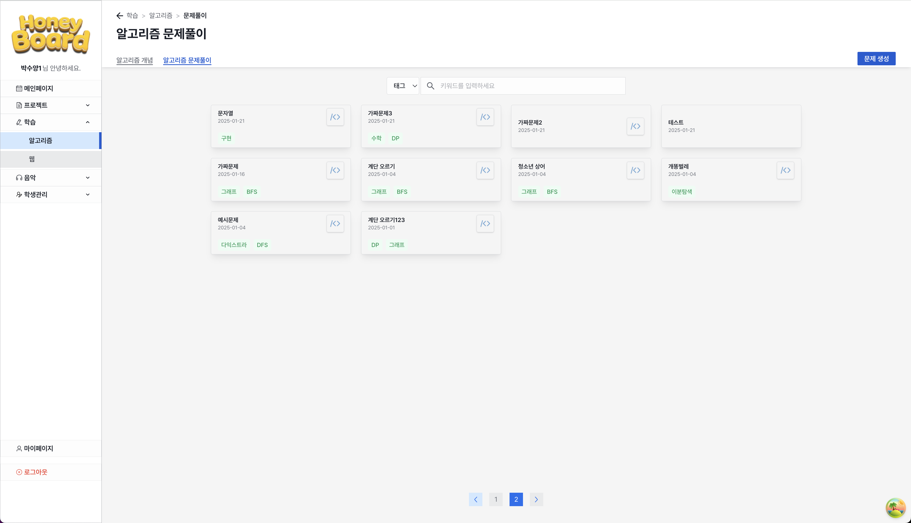
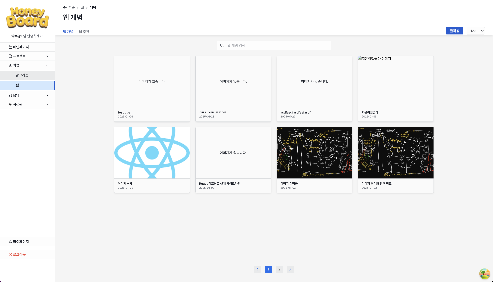
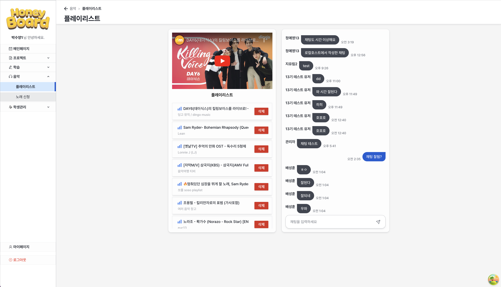
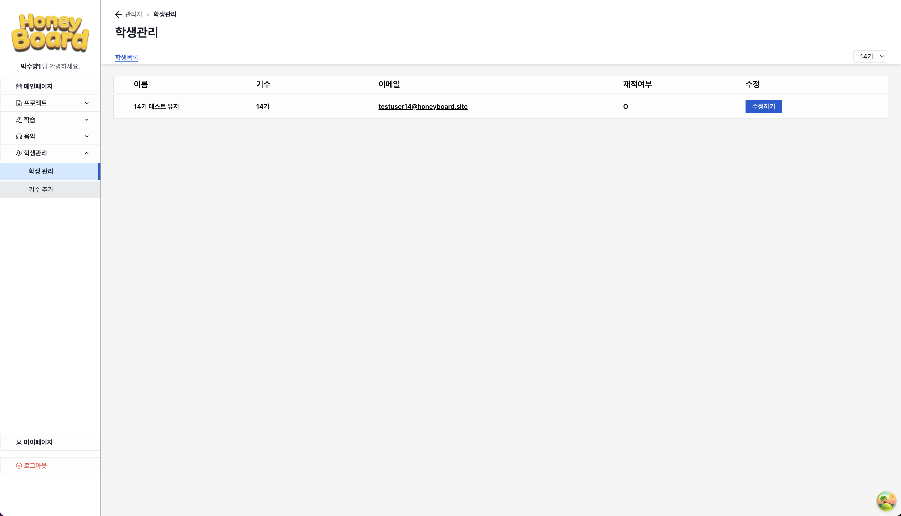
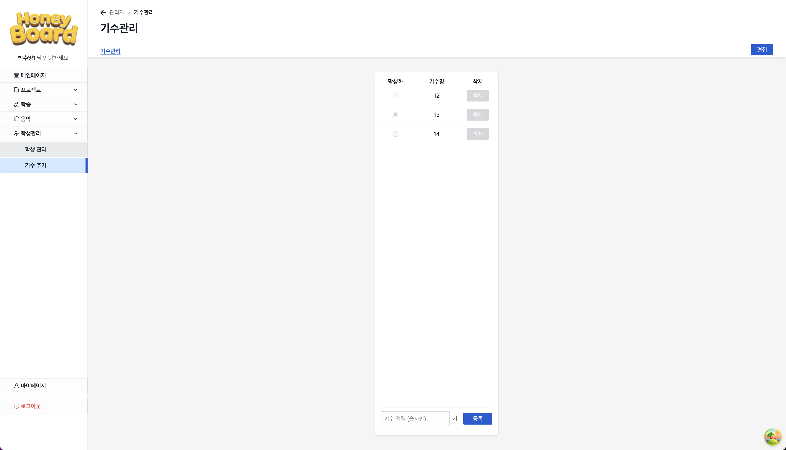

IT 강사님을 위한 학생 수업 관리 시스템

## 👥 팀원 소개

|  |  |  |  |  |
| :-------------------------------------------------------: | :---------------------------------------------------: | :---------------------------------------------------------: | :------------------------------------------------------: | :------------------------------------------------------: |
|                        **박수양**                         |                      **지유림**                       |                         **서주원**                          |                        **강수진**                        |                        **한재서**                        |
|               총괄, 프론트엔드 팀장, 백엔드               |                      백엔드 팀장                      |                   디자인 팀장, 프론트엔드                   |                          백엔드                          |                          백엔드                          |
|        [@clapsheep](https://github.com/clapsheep)         |          [@zyu22](https://github.com/zyu22)           |       [@lifehardmod](https://github.com/lifehardmod)        |         [@kkangssu](https://github.com/kkangssu)         |         [@rpeowiqu](https://github.com/rpeowiqu)         |

|  |  |  |  |  |
| :------------------------------------------------------: | :--------------------------------------------------------: | :----------------------------------------------------------: | :------------------------------------------------------: | :---------------------------------------------------: |
|                        **김종명**                        |                         **김유정**                         |                          **박성문**                          |                        **강지은**                        |                      **윤이영**                       |
|                        프론트엔드                        |                     프론트엔드/백엔드                      |                   프론트엔드/백엔드/디자인                   |                 프론트엔드/백엔드/디자인                 |                   프론트엔드/디자인                   |
|         [@jump6746](https://github.com/jump6746)         |        [@yujeong789](https://github.com/yujeong789)        |       [@SungMoonPark](https://github.com/SungMoonPark)       |         [@antisdun](https://github.com/antisdun)         |          [@y20ng](https://github.com/y20ng)           |

|  |  |
| :-------------------------------------------------------: | :--------------------------------------------------------: |
|                        **정예영**                         |                         **배성훈**                         |
|                       프론트엔드/QA                       |                       백엔드 테스트                        |
|        [@elitezer0](https://github.com/elitezer0)         |        [@baehoonbae](https://github.com/baehoonbae)        |

## 💡 프로젝트 소개

HoneyBoard는 IT 강사님들의 효율적인 수업 운영을 위한 올인원 수업 관리 플랫폼입니다.

### 주요 목적

- 강사와 학생 간의 원활한 소통과 학습 진행 상황 추적
- 체계적인 수업 자료 관리 및 공유
- 학생들의 제출 현황을 한눈에 파악할 수 있는 통합 관리 시스템

### 핵심 기능

- **수업 자료 관리**: 강의 자료, 참고 자료 등을 체계적으로 관리하고 공유
- **알고리즘 학습 지원**: 문제 은행, 카테고리별 분류, 학생들의 풀이 현황 공유
- **프로젝트 관리**: 팀 프로젝트 진행 상황, PDF 리포트 생성
- **학생 관리**: 과제 제출, 재적 관리

### 기대 효과

- 강사님들의 행정 업무 부담 감소
- 체계적인 학습 자료 아카이빙
- 데이터 기반의 학생 맞춤형 피드백 제공
- 효율적인 수업 운영을 통한 교육 품질 향상

## 🛠️ 기술 스택

### Frontend

### Backend

### Infrastructure

## 📌 주요 기능

### 1. 로그인 및 계정 관리

- 강사/학생 계정 분리 관리
- 보안성이 강화된 로그인 시스템
- 구글 로그인 연동
- 이메일 인증으로 보안 강화
- 권한별 차별화된 대시보드 제공

### 2. 일정 관리

- 수업 및 프로젝트 일정 통합 관리
- 캘린더 형식의 직관적인 UI
- 중요 일정 알림 기능

### 3. 프로젝트 관리

- 관통/파이널 프로젝트 제출 현황 모니터링
- 제출 여부에 따른 pdf 리포트 생성

### 4. 알고리즘 학습 관리

- 문제 은행 및 난이도별 분류
- 학생별 문제 풀이 현황 추적
- 성능 분석

### 5. 웹 개발 과정 관리

- 웹 개발 실습 자료 제공

### 6. 음악/미디어 자료 관리

- Youtube API 연동으로 플레이 리스트 구성
- 기수별 채팅방 운영

### 7. 학생 관리

- 학생 재적 관리

### 8. 기수 관리

- 기수 등록 삭제 및 활성화 관리

## 🔍 실행 방법

[허니보드 서비스 바로가기](https://honeyboard.site)
